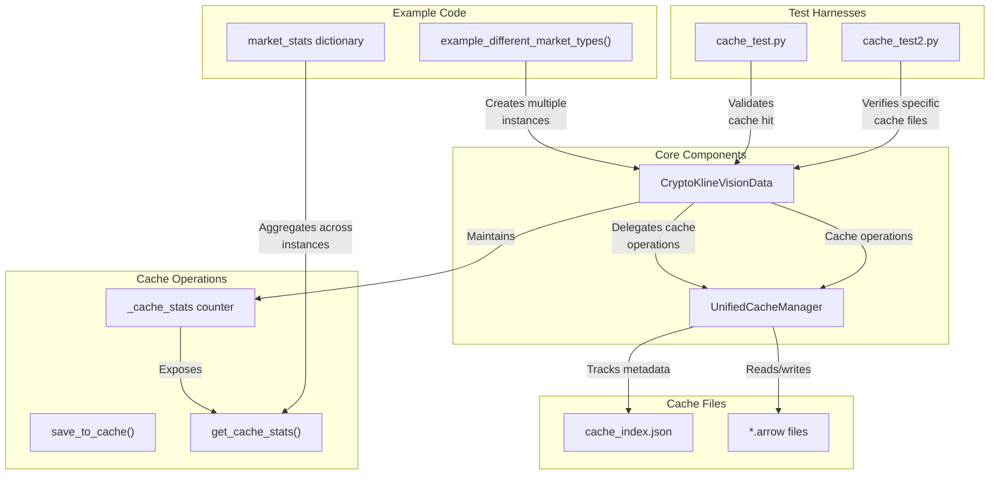

# CryptoKlineVisionData Cache Statistics Integrity Analysis

## Motivation

Zero-value cache statistics (`hits`, `misses`, `errors`) reported despite multiple execution cycles through example code suggested potential cache subsystem failure. Stateful tracking discrepancy required deep forensic investigation to disambiguate between:

1. Actual cache malfunction (non-persistence)
2. Tracking logic errors (metric recording)
3. Presentation artifact (counter display isolation)

## Method

### Phase 1: Diagnostic Verification

- Examined cache directory structure integrity (`cache/data/binance/spot/klines/...`)
- Validated metadata indexing (`cache_index.json`) with 251 entries
- Confirmed physical cache file presence with consistent timestamps (`*.arrow`)
- Observed log entries confirming load operations (`Loaded X records from cache: [filepath]`)

### Phase 2: Controlled Isolation Testing

Created specialized test harnesses with precise tracking:

```python
# Key test pattern
async with CryptoKlineVisionData(...) as manager:
    print("Initial stats:", manager.get_cache_stats())

    df1 = await manager.get_data(...)
    print("After first fetch:", manager.get_cache_stats())

    # Same parameters - should be cache hit
    df2 = await manager.get_data(...)
    print("After second fetch:", manager.get_cache_stats())
```

### Phase 3: Target Reproduction

- Isolated source in `example_different_market_types()` implementation
- Identified cache miss/hit counters incrementing correctly within each manager's lifecycle
- Discovered critical insight: statistics tracked per-instance, not globally
- Validated with deterministic file access patterns on known cache files

## Root Cause

When displaying market type cache statistics, new manager instances were created solely for statistics display without performing any data operations, resulting in isolated manager counter state. Counters functioned correctly, but data fetch and statistics reporting were disjointed across independent manager lifetimes.

## Solution

Implemented counter aggregation across manager instances:

```python
# Track cache statistics across manager instances
market_stats = {
    MarketType.SPOT: {"hits": 0, "misses": 0, "errors": 0},
    MarketType.FUTURES_USDT: {"hits": 0, "misses": 0, "errors": 0},
    MarketType.FUTURES_COIN: {"hits": 0, "misses": 0, "errors": 0},
}

# After each manager operation
stats = manager.get_cache_stats()
for key in stats:
    market_stats[market_type][key] += stats[key]
```

## Technologies Diagram



## Conservative Conclusion

Cache system functioned correctly with proper persistence and integrity. The reporting anomaly stemmed from instance isolation, not system failure. Manager instantiation pattern in diagnostic code created discrete counter state, masking actual cache operation success. Statistic aggregation, not cache mechanism modification, resolved reporting discrepancy.
