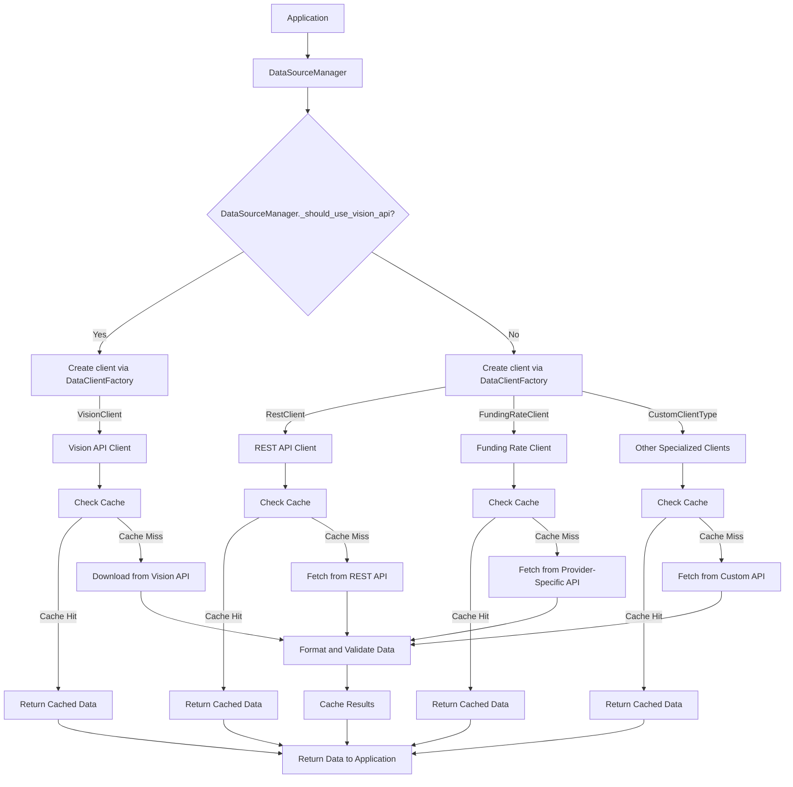
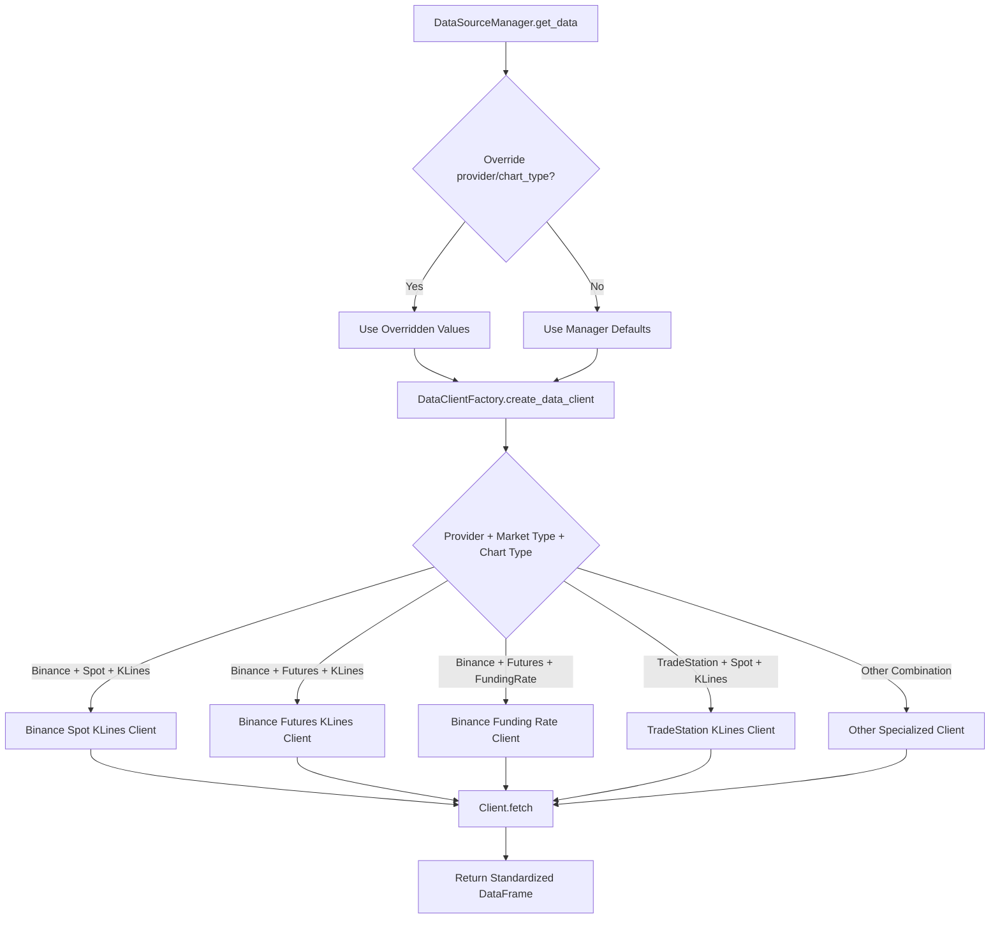
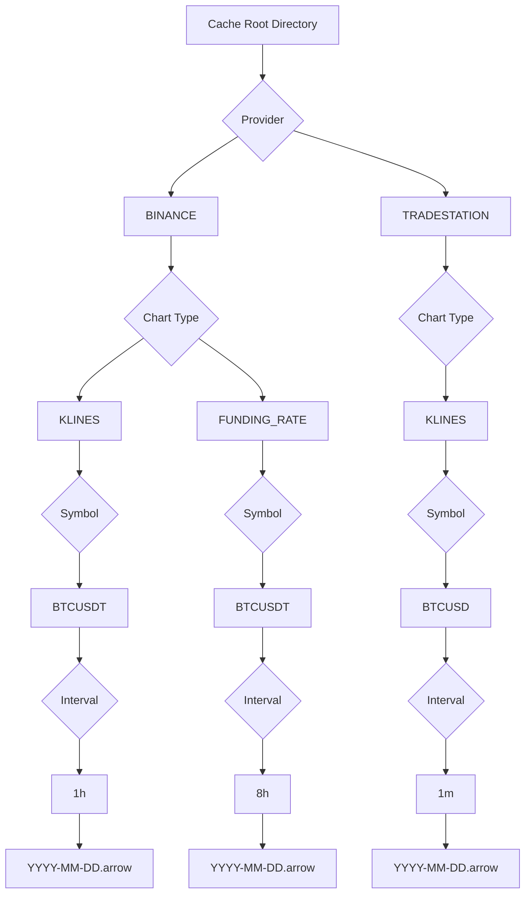
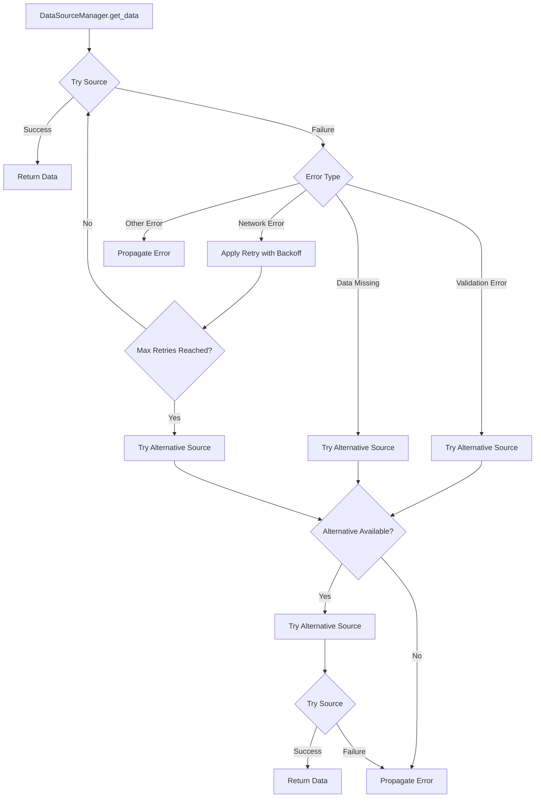

# Core Workflow in Mermaid

## Data Retrieval Flow

```mermaid
graph TD
    A[Application] --> B[DataSourceManager]
    B --> C{DataSourceManager._should_use_vision_api?}
    C -->|Yes| D[Create client via DataClientFactory]
    C -->|No| E[Create client via DataClientFactory]

    D -->|VisionClient| F[Vision API Client]
    E -->|RestClient| G[REST API Client]
    E -->|FundingRateClient| H[Funding Rate Client]
    E -->|CustomClientType| I[Other Specialized Clients]

    F --> J[Check Cache]
    G --> K[Check Cache]
    H --> L[Check Cache]
    I --> M[Check Cache]

    J -->|Cache Hit| N[Return Cached Data]
    J -->|Cache Miss| O[Download from Vision API]
    K -->|Cache Hit| P[Return Cached Data]
    K -->|Cache Miss| Q[Fetch from REST API]
    L -->|Cache Hit| R[Return Cached Data]
    L -->|Cache Miss| S[Fetch from Provider-Specific API]
    M -->|Cache Hit| T[Return Cached Data]
    M -->|Cache Miss| U[Fetch from Custom API]

    O --> V[Format and Validate Data]
    Q --> V
    S --> V
    U --> V

    V --> W[Cache Results]
    W --> X[Return Data to Application]
    N --> X
    P --> X
    R --> X
    T --> X
```

## Factory and Client Flow

```mermaid
graph TD
    A[DataSourceManager.get_data] --> B{Override provider/chart_type?}
    B -->|Yes| C[Use Overridden Values]
    B -->|No| D[Use Manager Defaults]

    C --> E[DataClientFactory.create_data_client]
    D --> E

    E --> F{Provider + Market Type + Chart Type}

    F -->|Binance + Spot + KLines| G[Binance Spot KLines Client]
    F -->|Binance + Futures + KLines| H[Binance Futures KLines Client]
    F -->|Binance + Futures + FundingRate| I[Binance Funding Rate Client]
    F -->|TradeStation + Spot + KLines| J[TradeStation KLines Client]
    F -->|Other Combination| K[Other Specialized Client]

    G --> L[Client.fetch]
    H --> L
    I --> L
    J --> L
    K --> L

    L --> M[Return Standardized DataFrame]
```

## Cache Structure

```mermaid
graph TD
    A[Cache Root Directory] --> B{Provider}
    B --> C[BINANCE]
    B --> D[TRADESTATION]

    C --> E{Chart Type}
    D --> F{Chart Type}

    E --> G[KLINES]
    E --> H[FUNDING_RATE]
    F --> I[KLINES]

    G --> J{Symbol}
    H --> K{Symbol}
    I --> L{Symbol}

    J --> M[BTCUSDT]
    K --> N[BTCUSDT]
    L --> O[BTCUSD]

    M --> P{Interval}
    N --> Q{Interval}
    O --> R{Interval}

    P --> S[1h]
    Q --> T[8h]
    R --> U[1m]

    S --> V[YYYY-MM-DD.arrow]
    T --> W[YYYY-MM-DD.arrow]
    U --> X[YYYY-MM-DD.arrow]
```

## Error Handling Flow

```mermaid
graph TD
    A[DataSourceManager.get_data] --> B{Try Source}
    B -->|Success| C[Return Data]
    B -->|Failure| D{Error Type}

    D -->|Network Error| E[Apply Retry with Backoff]
    D -->|Validation Error| F[Try Alternative Source]
    D -->|Data Missing| G[Try Alternative Source]
    D -->|Other Error| H[Propagate Error]

    E --> I{Max Retries Reached?}
    I -->|No| B
    I -->|Yes| J[Try Alternative Source]

    F --> K{Alternative Available?}
    G --> K
    J --> K

    K -->|Yes| L[Try Alternative Source]
    K -->|No| M[Propagate Error]

    L --> N{Try Source}
    N -->|Success| O[Return Data]
    N -->|Failure| M
```
