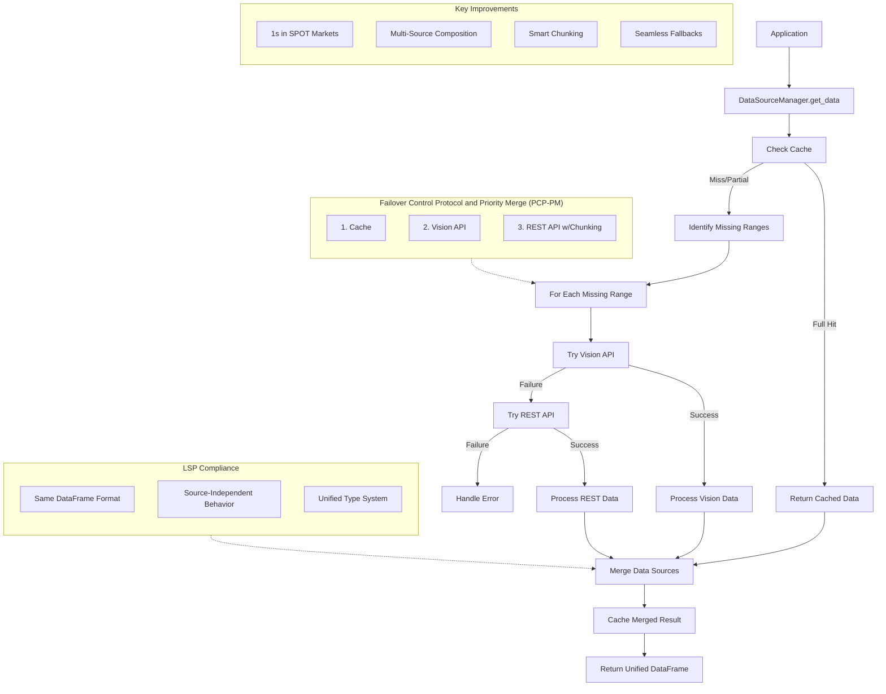
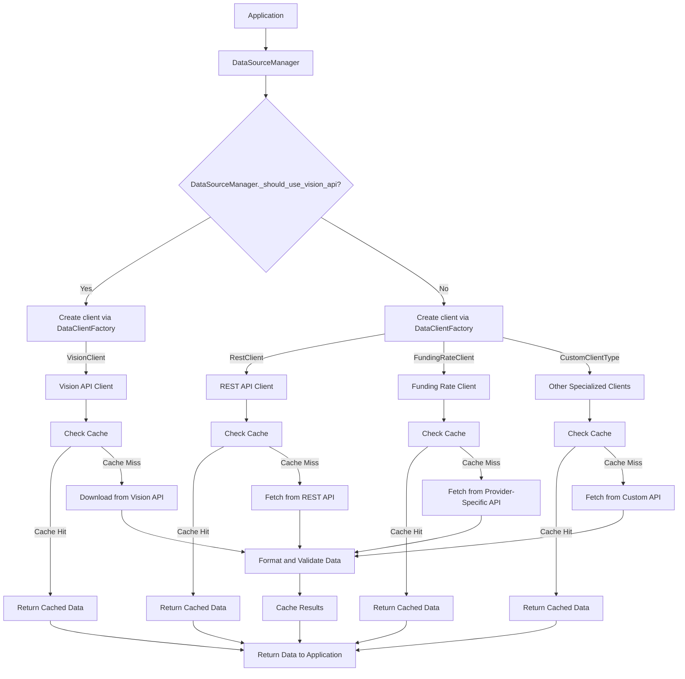
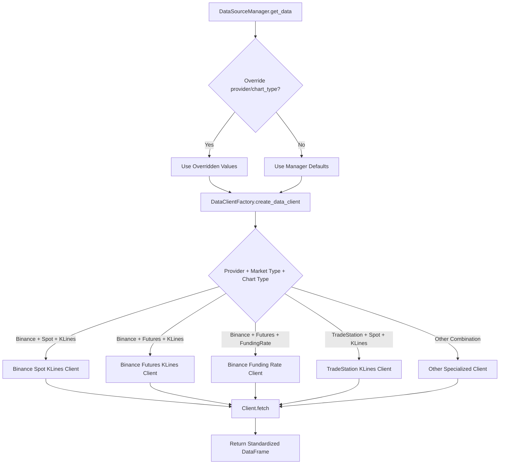
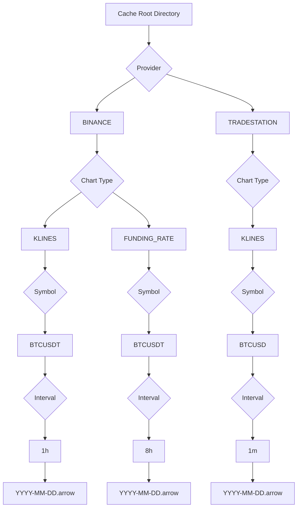
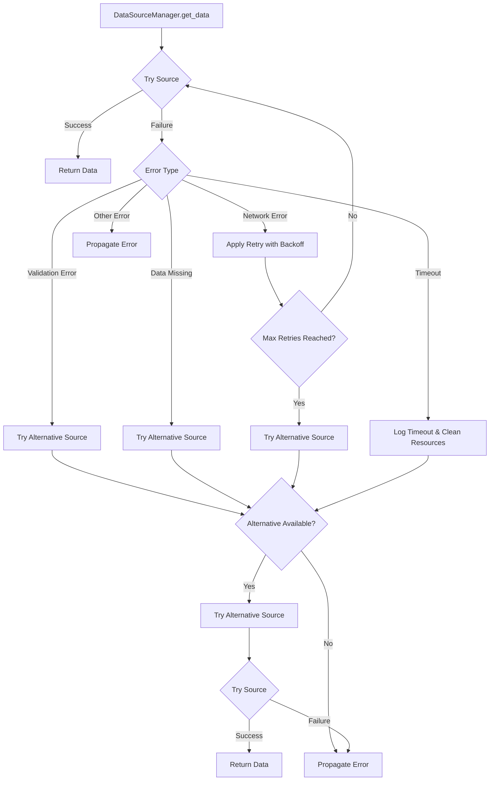
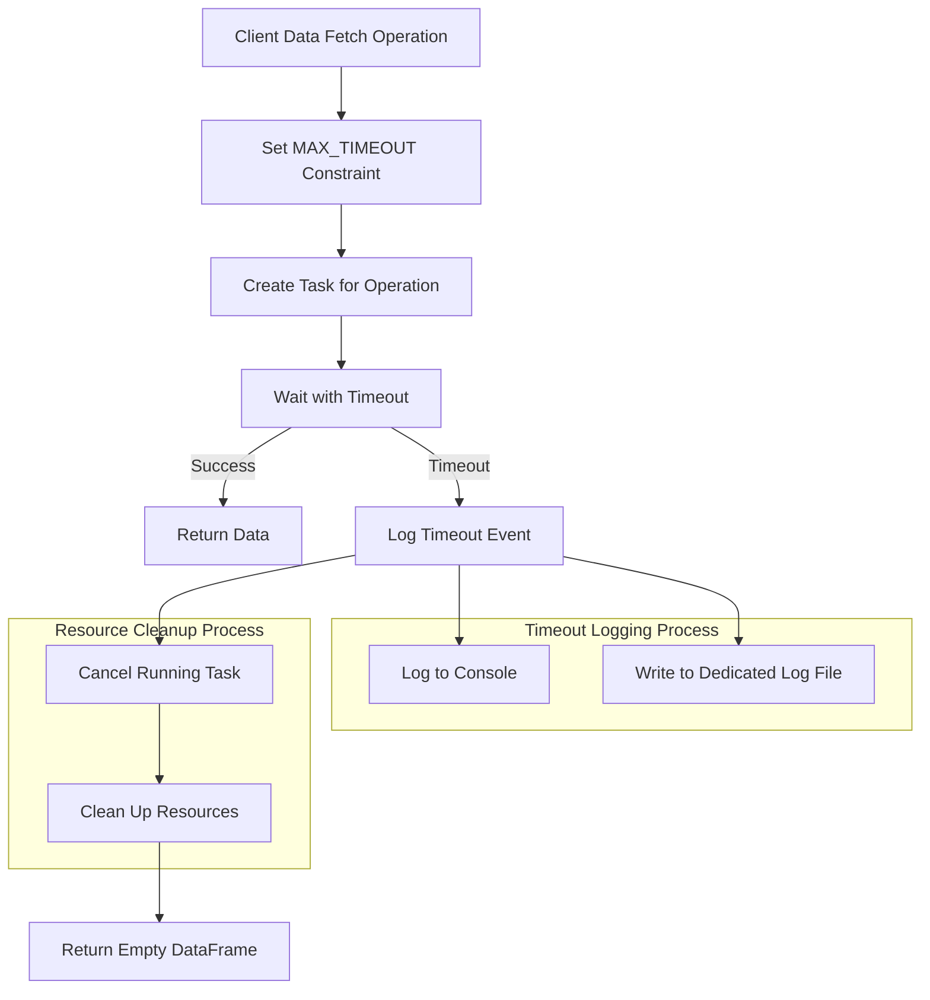

# Core Workflow in Mermaid

## Refactored Data Source Selection Flow

```mermaid
flowchart TD
    %% Main application flow
    A[Application] --> B[DataSourceManager.get_data]
    B --> C[Check Cache]

    %% Cache handling
    C -->|Full Hit| D[Return Cached Data]
    C -->|Miss/Partial| E[Identify Missing Ranges]

    %% Process each missing range
    E --> F[For Each Missing Range]

    %% Vision API attempt
    F --> G[Try Vision API]
    G -->|Success| H[Process Vision Data]
    G -->|Failure| I[Try REST API]

    %% REST API fallback with chunking
    I -->|Success| J[Process REST Data]
    I -->|Failure| K[Handle Error]

    %% Data merging from all sources
    H --> L[Merge Data Sources]
    J --> L
    D --> L

    %% Final steps
    L --> M[Cache Merged Result]
    M --> N[Return Unified DataFrame]

    %% Visual grouping for PCP-PM concept
    subgraph PCP-PM["Failover Control Protocol and Priority Merge (PCP-PM)"]
        direction TB
        P1[1. Cache]
        P2[2. Vision API]
        P3[3. REST API w/Chunking]
    end

    %% Connect PCP-PM concept to flow
    PCP-PM -.-> F

    %% LSP compliance
    subgraph LSP["LSP Compliance"]
        direction TB
        L1["Same DataFrame Format"]
        L2["Source-Independent Behavior"]
        L3["Unified Type System"]
    end

    %% Connect LSP to merge step
    LSP -.-> L

    %% Key improvements
    subgraph IMP["Key Improvements"]
        direction TB
        I1["1s in SPOT Markets"]
        I2["Multi-Source Composition"]
        I3["Smart Chunking"]
        I4["Seamless Fallbacks"]
    end
```

## Data Retrieval Flow

```mermaid
graph TD
    A[Application] --> B[DataSourceManager]
    B --> C{DataSourceManager._should_use_vision_api?}
    C -->|Yes| D[Create client via DataClientFactory]
    C -->|No| E[Create client via DataClientFactory]

    D -->|VisionClient| F[Vision API Client]
    E -->|RestClient| G[REST API Client]
    E -->|FundingRateClient| H[Funding Rate Client]
    E -->|CustomClientType| I[Other Specialized Clients]

    F --> J[Check Cache]
    G --> K[Check Cache]
    H --> L[Check Cache]
    I --> M[Check Cache]

    J -->|Cache Hit| N[Return Cached Data]
    J -->|Cache Miss| O[Download from Vision API]
    K -->|Cache Hit| P[Return Cached Data]
    K -->|Cache Miss| Q[Fetch from REST API]
    L -->|Cache Hit| R[Return Cached Data]
    L -->|Cache Miss| S[Fetch from Provider-Specific API]
    M -->|Cache Hit| T[Return Cached Data]
    M -->|Cache Miss| U[Fetch from Custom API]

    O --> V[Format and Validate Data]
    Q --> V
    S --> V
    U --> V

    V --> W[Cache Results]
    W --> X[Return Data to Application]
    N --> X
    P --> X
    R --> X
    T --> X
```

## Factory and Client Flow

```mermaid
graph TD
    A[DataSourceManager.get_data] --> B{Override provider/chart_type?}
    B -->|Yes| C[Use Overridden Values]
    B -->|No| D[Use Manager Defaults]

    C --> E[DataClientFactory.create_data_client]
    D --> E

    E --> F{Provider + Market Type + Chart Type}

    F -->|Binance + Spot + KLines| G[Binance Spot KLines Client]
    F -->|Binance + Futures + KLines| H[Binance Futures KLines Client]
    F -->|Binance + Futures + FundingRate| I[Binance Funding Rate Client]
    F -->|TradeStation + Spot + KLines| J[TradeStation KLines Client]
    F -->|Other Combination| K[Other Specialized Client]

    G --> L[Client.fetch]
    H --> L
    I --> L
    J --> L
    K --> L

    L --> M[Return Standardized DataFrame]
```

## Cache Structure

```mermaid
graph TD
    A[Cache Root Directory] --> B{Provider}
    B --> C[BINANCE]
    B --> D[TRADESTATION]

    C --> E{Chart Type}
    D --> F{Chart Type}

    E --> G[KLINES]
    E --> H[FUNDING_RATE]
    F --> I[KLINES]

    G --> J{Symbol}
    H --> K{Symbol}
    I --> L{Symbol}

    J --> M[BTCUSDT]
    K --> N[BTCUSDT]
    L --> O[BTCUSD]

    M --> P{Interval}
    N --> Q{Interval}
    O --> R{Interval}

    P --> S[1h]
    Q --> T[8h]
    R --> U[1m]

    S --> V[YYYY-MM-DD.arrow]
    T --> W[YYYY-MM-DD.arrow]
    U --> X[YYYY-MM-DD.arrow]
```

## Error Handling Flow

```mermaid
graph TD
    A[DataSourceManager.get_data] --> B{Try Source}
    B -->|Success| C[Return Data]
    B -->|Failure| D{Error Type}

    D -->|Network Error| E[Apply Retry with Backoff]
    D -->|Validation Error| F[Try Alternative Source]
    D -->|Data Missing| G[Try Alternative Source]
    D -->|Timeout| H[Log Timeout & Clean Resources]
    D -->|Other Error| I[Propagate Error]

    E --> J{Max Retries Reached?}
    J -->|No| B
    J -->|Yes| K[Try Alternative Source]

    F --> L{Alternative Available?}
    G --> L
    K --> L
    H --> L

    L -->|Yes| M[Try Alternative Source]
    L -->|No| N[Propagate Error]

    M --> O{Try Source}
    O -->|Success| P[Return Data]
    O -->|Failure| N
```

## Timeout Handling Flow

```mermaid
graph TD
    A[Client Data Fetch Operation] --> B[Set MAX_TIMEOUT Constraint]
    B --> C[Create Task for Operation]
    C --> D[Wait with Timeout]

    D -->|Success| E[Return Data]
    D -->|Timeout| F[Log Timeout Event]

    F --> G[Log to Console]
    F --> H[Write to Dedicated Log File]

    F --> I[Cancel Running Task]
    I --> J[Clean Up Resources]
    J --> K[Return Empty DataFrame]

    subgraph Timeout Logging Process
        G
        H
    end

    subgraph Resource Cleanup Process
        I
        J
    end
```
