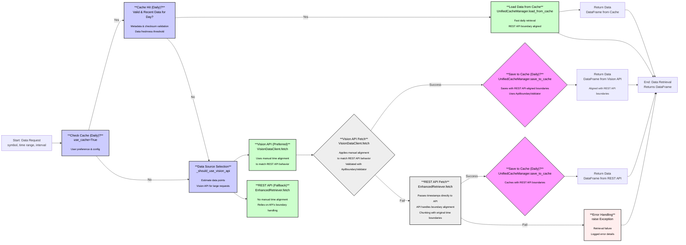

# Market Data Retrieval Workflow

## Updated Workflow Overview

This diagram illustrates the revamped market data retrieval workflow, with a specific focus on the updated time alignment strategy. Key changes include:

1. **REST API Path**: When using the REST API, timestamps are passed directly without manual alignment. The API inherently handles boundary alignment according to its documented behavior.

2. **Vision API Path**: When using the Vision API, manual time alignment is applied to mirror REST API behavior. This ensures consistent results across data sources.

3. **Cache Operations**: Cache keys and data validation use REST API-aligned timestamps, ensuring consistency between cached data and what would be returned by direct API calls.

4. **Validation**: The `ApiBoundaryValidator` is used to validate time boundaries and data ranges against the REST API's behavior, ensuring consistency.

## Process Description

The data retrieval process begins with a user request for market data. The system first checks if REST API-aligned cached data is available and valid. If valid cache exists, it is loaded.

Otherwise, the system selects the data source based on request parameters:

- **Vision API Path**: Applies manual time alignment to match REST API behavior, downloads data, validates with `ApiBoundaryValidator`, and caches with REST API-aligned boundaries.

- **REST API Path**: Passes timestamps directly to the API without manual alignment, allowing the API to handle boundary alignment inherently. Chunks requests with original time boundaries.

All data sources are now aligned with Binance REST API's boundary behavior, whether through direct API calls or manual alignment for Vision API and cache operations.

This updated approach:

- Simplifies REST API calls by removing unnecessary manual alignment
- Ensures Vision API and cache operations precisely mirror REST API behavior
- Uses real-world API validation through `ApiBoundaryValidator` to verify alignment
- Provides consistent results regardless of data source
