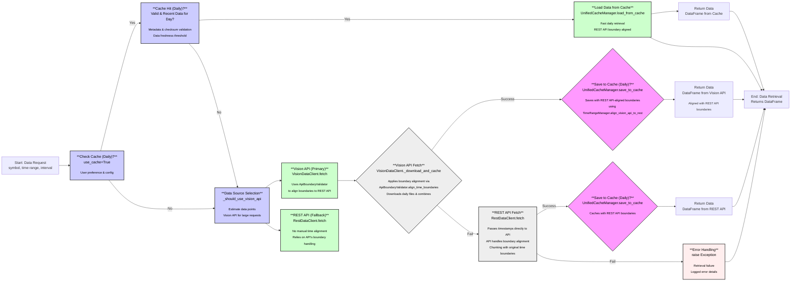

# Market Data Retrieval Workflow

## Updated Workflow Overview

This diagram illustrates the market data retrieval workflow, with a specific focus on the time alignment strategy. Key aspects include:

1. **REST API Path**: When using the REST API, timestamps are passed directly without manual alignment. The API inherently handles boundary alignment according to its documented behavior.

2. **Vision API Path**: When using the Vision API, manual time alignment is applied via `ApiBoundaryValidator.align_time_boundaries()` to match REST API behavior. This ensures consistent results across data sources.

3. **Cache Operations**: Cache keys and data validation use REST API-aligned timestamps, ensuring consistency between cached data and what would be returned by direct API calls.

4. **Boundary Alignment**: The system uses two complementary alignment approaches:
   - `ApiBoundaryValidator.align_time_boundaries()` - Used directly in Vision API fetch operations
   - `TimeRangeManager.align_vision_api_to_rest()` - Used for cache operations and data filtering

## Process Description

The data retrieval process begins with a user request for market data. The system first checks if REST API-aligned cached data is available and valid. If valid cache exists, it is loaded.

Otherwise, the system selects the data source based on request parameters:

- **Vision API Path (Primary)**: The system typically prefers Vision API for most requests, especially larger ones. It applies precise time boundary alignment using `ApiBoundaryValidator.align_time_boundaries()`, downloads data by day, combines results, and caches with REST API-aligned boundaries.

- **REST API Path (Fallback)**: Passes timestamps directly to the API without manual alignment, allowing the API to handle boundary alignment inherently. Chunks requests with original time boundaries.

All data sources are now aligned with Binance REST API's boundary behavior, whether through direct API calls or manual alignment for Vision API and cache operations.

This approach provides several advantages:

- **Consistency**: All data sources (REST API, Vision API, and cache) deliver identical results for the same time range query
- **Efficiency**: REST API calls are simplified by removing unnecessary manual alignment
- **Precision**: Vision API alignment accurately mirrors REST API behavior for exact data compatibility
- **Validation**: Uses real-time API alignment information through `ApiBoundaryValidator` rather than hard-coded rules
- **Resilient Caching**: Cache operations use consistent boundary alignment for reliable lookups
