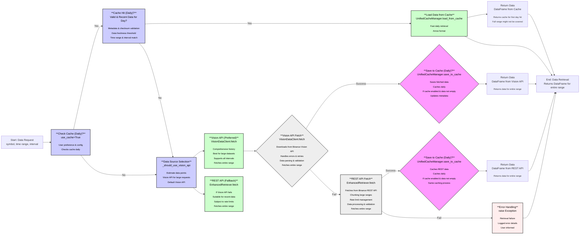

# Mermaid Flowchat

This diagram illustrates the core workflow for retrieving market data. It starts with a data request, checks for daily cached data, and if not available, selects between Vision API (preferred) and REST API (fallback) to fetch the data. Fetched data can be saved to the cache for future use. The process concludes by returning the requested DataFrame or handling errors if data retrieval fails.

Below is a prose explanation of the workflow depicted in the diagram:

> The data retrieval process begins with a user request for market data, specifying the symbol, time range, and interval. The system first checks if daily cached data is available and valid. If a valid daily cache exists, it is loaded for fast retrieval. Otherwise, the system intelligently selects the data source, preferring the Vision API for its comprehensive historical data and large dataset capabilities. If the Vision API fetch fails, the system falls back to the REST API. Data fetched from either API is then processed, validated, and returned to the user as a DataFrame. Optionally, the fetched data can be saved to the cache on a daily basis to expedite future requests. Error handling is integrated throughout the process to manage potential issues and inform the user of any retrieval failures.

**Key Changes:**

- **Block H Label Corrected**: Block `H` now correctly displays "**REST API Fetch**" and its descriptive text, clarifying its role in fetching data from the REST API.
- **Prose Explanation Added**: A paragraph explaining the overall workflow in prose format is included below the Mermaid diagram, providing a textual summary of the visual representation.

This updated `docs/core_workflow_in_mermaid.md` file should now be complete with a clear diagram and a helpful textual overview of the data retrieval workflow.
